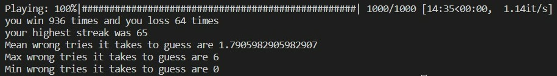
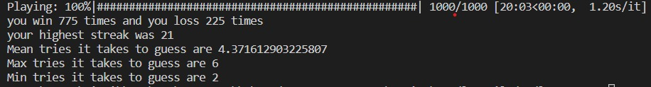
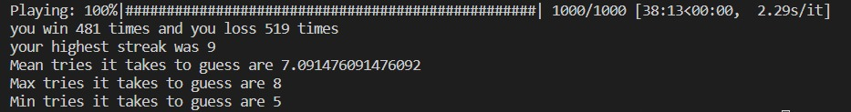
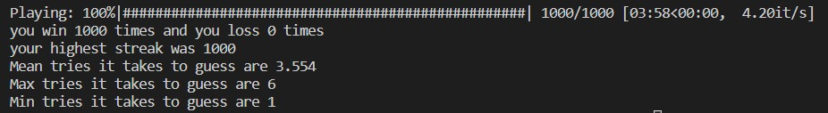

# AbsurdAgents_agents_Kshatriya


## Usage 
Git clone the repository 
```bash
git clone https://github.com/rudradeep22/AbsurdAgents_agents_Kshatriya.git
```
change the working directory to the server
```
cd AbsurdAgents_agents_Kshatriya
```
Install required python libraries
```bash
pip install -r requirements.txt
```
### For Hangman:
change working directory to hangman:
```shell
cd hangman
```
- `script.py` -> This is the Agent for hangman
Run it to play with server
```shell
python script.py
```
### For Schrödinger's cat:
change working directory to Schrodinger:
```shell
cd Schrodinger
```
- `script.py` -> This is the Agent for Schrödinger's cat
Run it to play with server
```shell
python script.py
```
### For Wordle , Evil Wordle and dordle :
- `parse_data.py` -> parses the raw data contained in data-raw and put it into data-parsed
- `possibilities_table.py` -> computes the possibilities matrix
- `solvewordle.py` -> This is an agent for Wordle. It playes on server
- `solvedordle.py` -> This is an agent for Dordle. It playes on server
- `solveevil.py` -> This is an agent for Evil Wordle. It playes on server

Run this to generate possibilities table
```shell
python parse_data.py
python possibilities_table.py
```
Then you can run the agents with:

for Wordle - 
```shell
python solvewordle.py
```
for Evil Wordle - 
```shell
python solveevil.py
```
for Dordle - 
```shell
python solvedordle.py
```

## HANGMAN


### Overview

This Hangman Agent is designed to play the game of Hangman using a Bigram Language Model. It uses a statistical language model that estimates the likelihood of words based on the previous word.

The Bigram Model starts by analyzing a large corpus of text (*words_250000_train.txt*) to learn word patterns and relationships.
It calculates the conditional probability of a word occurring, given the previous word in a sentence. In other words, it estimates the likelihood of a word, W, following a specific preceding word, W-1.
These probabilities are stored in a database-like structure where each word W-1 is associated with a list of possible following words (W). This database is used for predictions during the Hangman game.


### Agent Statistics
The model is able make a successfull prediction 93.6% of the times.



## Wordle 

### Overview

The wordle agent is designed to guess the word by making predictions using a decision tree. The decision tree starts with a set of all possible five letter words from a predefined word list.\
After making the initial gues the decision tree banches out based on the feedback received. The decision tree keeps expanding and considers each possible combination of letters that matches the feedback and prunes words that are inconsistent with the feedback.

### Agent Statistics

Based on our test runs the model is able successfully guess the word 77.5% of the times




## Dordle

### Overview

The model is based on a similar desicion tree approach as the wordle model. The agent makes an initial guess, receives a feedback and starts building a decision tree based on the feedback.\
The agent iteratively makes guesses and expands the decision tree further and narrows down the possibilities. The agent is designed to play the game efficiently by leveraging feedback and making educated guesses to find the words.

### Agent Statistics
Based on our test runs the agent is able to correctly guess both the words 48% of the times


## Evil Wordle

### Overview

This agent is designed to make a prediction using a desicion tree. The agent starts with making an initial guess and then expands the decision tree based on the feedback it receives from the server. The difference is that instead of going for the most likely partition the agent is designed to look for the worst partition. This approach ensures that the agent is able to arrive at the correct word.

### Agent Statistics
Since the agent goes for the shortest and the worst partition it is always able to correctly guess the word in the given number of trials.
## Schrodinger's Cat

### Overview

The agent for this game is based on basic problem solving. Since the cat is allowed to only move to an adjacent box after every move, we can construct a sequence that ensures that we are guranteed to find the cat without fail.

### Agent Statistics
Since we have a surefire way of finding the cat the model has an accuracy of 100%


